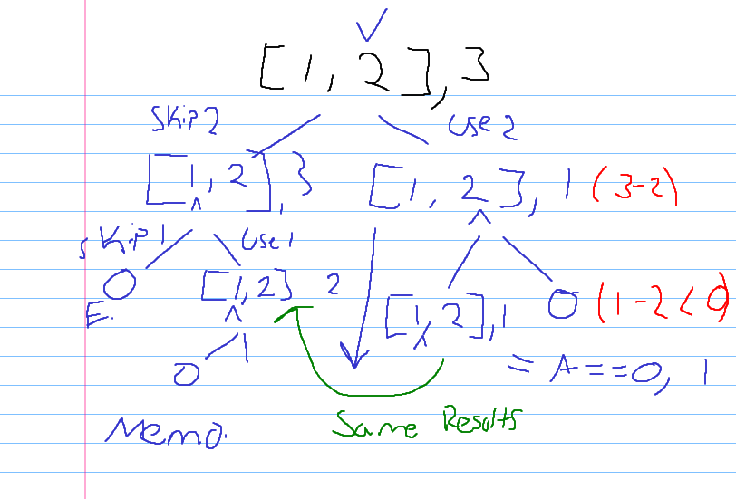
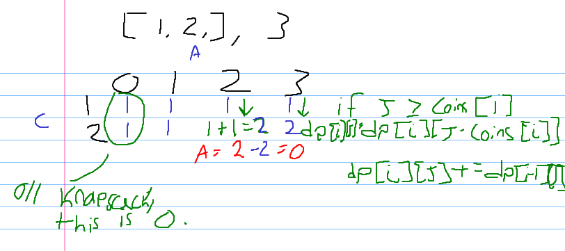
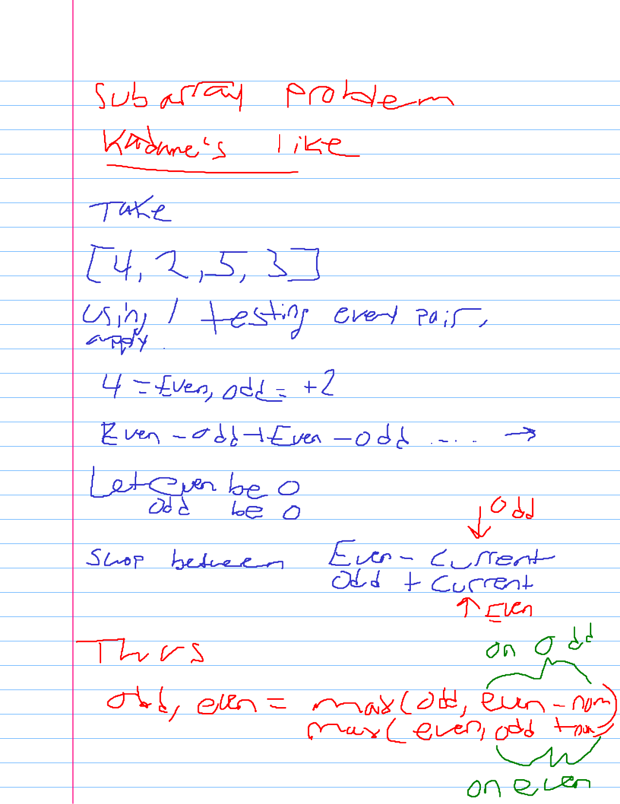
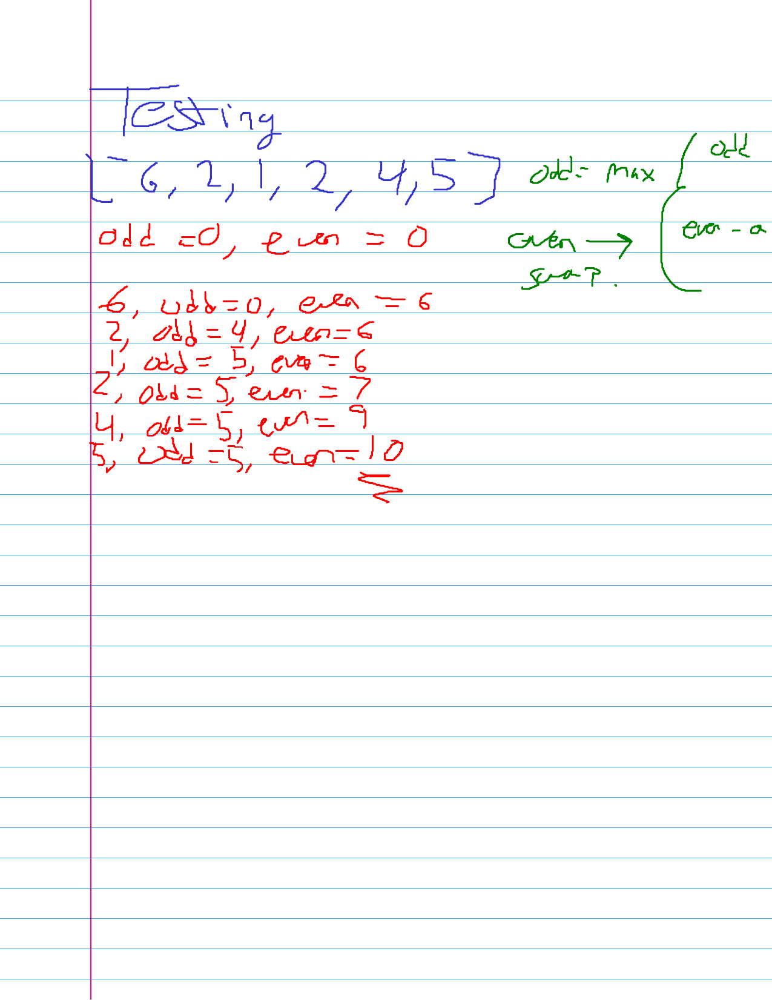
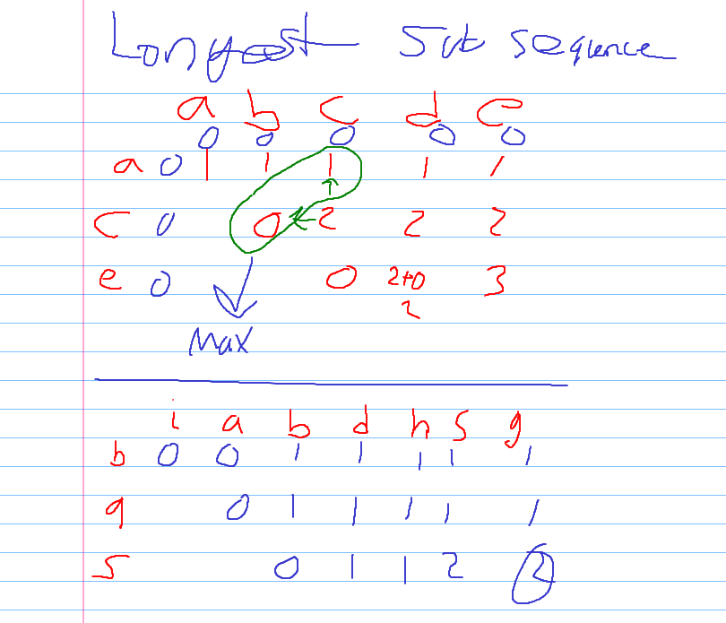

# Dynamic Programming Problems

- [Dynamic Programming Problems](#dynamic-programming-problems)
    - [Algorithm Groups](#algorithm-groups)
    - [Coin Change II](#coin-change-ii)
    - [Maximum Alternating Subsequence Sum](#maximum-alternating-subsequence-sum)
    - [Best Sightseeing Pair](#best-sightseeing-pair)
    - [Longest Common Subsequence](#longest-common-subsequence)


### Algorithm Groups

Knapsack O/1 - Coin Change II
Keep/Flip - Maximum Alternating Subsequence Sum
Kadane's Algorithm - Best Sightseeing Pair

### [Coin Change II](https://leetcode.com/problems/coin-change-2/)

Tasked with finding the number of unique ways we can form the given the amount, given the set of coins.

```
Input = [1,2,5]
Amount = 5
```

Instantly one could think of a brute-force like solution as to where we would recursively move down a tree, selecting either the same coin or a new coin each time.

**For example:**
```
Input = [1,2]
Amount = 2
```

At first glance the number of possibilities is 2. We're able to choose from either (1,1) or (2) ways. Next we could begin the recursive approach by moving down a tree starting at the highest number.

**Top-Down Approach**



> The code for this is quite simple.


```python
from functools import lru_cache

coins, amount = [1,2], 3
# i = index, a = amount

@lru_cache
def helper(i, a):
    if i < 0:
        return 0
    if a < 0:
        return 0
    if a == 0:
        return 1
    return helper(i - 1, a) + helper(i, a - coins[i])
print(f'Number of Unique Solutions {helper(len(coins) - 1, amount)}.')
```

    Number of Unique Solutions 2.


**Optimizing**

The above solution using recursion + memoization is quite eloquent though we can reduce the time complexity down by introducing space into the mix, on other words an iterative solution.

**Bottom-Up Approach**



> I decided to go ahead and optimize my code on space as well!

The current space requirement is O(a*n) where a is amount and n is number of coins. We can reduce this to O(a) by noticing that we only ever use one entire line, only referencing the top line to retrieve our previous result. Thus we can continually overwrite the **previous** result with our current which uses **previous**.


```python
from typing import List

def change(amount: int, coins: List[int]) -> int:
    dp = [0 for _ in range(amount + 1)]
    dp[0] = 1
    for i in coins:
        for j in range(1, amount + 1):
            if i <= j:
                dp[j] += dp[j - i]
    return dp[-1]
print(f'Number of Unique Solutions {change(amount, coins)}.')
```

    Number of Unique Solutions 2.


### [Maximum Alternating Subsequence Sum](https://leetcode.com/problems/maximum-alternating-subsequence-sum/)

This problem and one I had done afterwards kept getting me at the "subsequence" vs "subarray".

**Subarray:** Is a contiguous, increasing in index partition of the main array.
**Subsequence:** Is a non-contiguous, increasing in index partition of the main array.

The main difference between the two is that the sum doesn't have to be contiguous but rather increasing.
[This page should help clear any confusion](https://medium.com/javarevisited/subarray-vs-subsequence-do-you-know-the-difference-3de0a2c2df52)

Now onto the problem!

We have to come up with a solution where the subsequence is maximized.

**Mistakes Made**

When I first tackled this problem I actually devised a way using O(n^2) time and space using Dynamic Programming to compute this with a contiguous subarray, not a subsequence, whoops!

Even with these kinds of problems we have to take into account that **Kadane's Algorithm** and others exist that handle maximizing our array/list.

**Rationalizing The Problem**

After failing epicly I took a step back and took what I had came up with recently. In the first attempt I had broken down indices *i* to *j* where i and j represent the start and end of the subarray. Inbetween i and j a rolling sum was used where:

1. ```if i == j, return nums[i]```
2. ```if |i - j| > 1, rolling_sum += nums[j] * (-1 ** j)```

In each case the previous row and column was used as a comparison between some maximization.

Notice two things:
1. We calculate the rolling_sum on the go.
2. Any index could be even or odd if selected at the right time, meaning [1,2,3] we could have subsequences [1,2] or [2,3] and because of this 2 is both even and odd.

Therefore we can actually do this in O(n) time with O(1) space by computing at a given index it being odd or even.

The following below depicts everything needed for the problem and a practice problem from the examples.





```python
from typing import List

def maxAlternatingSum(nums: List[int]) -> int:
    odd, even = 0, 0
    for num in nums:
        odd, even = max(odd, even - num), max(even, odd + num)
    return even
print(f'Maximum value of the subsequence is {maxAlternatingSum([6,2,1,2,4,5])}.')
```

    Maximum value of the subsequence is 10.


### [Best Sightseeing Pair](https://leetcode.com/problems/best-sightseeing-pair/submissions/)

The problem in itself may be easily solved using dynamic programming by constructing a N x N matrix and computing between the ith and jth columns our max value given the constraints listed by the problem itself. Below are some notes I have on the matter:

```
            8   1   5   2   6
        8   8   8   11  11  11
        1       1   5   6   9
        5           5   6   9
        2               2   7
        6                   6

        dp[i][j] = max(
            dp[i][j - 1],
            dp[i + 1][j],
            values[i] + values[j] + i - j
        )

        Time O(n^2), Space O(n^2)
```

We can obviously do better by utilizing some knowledge gained by this.

First off:
1. We don't care about what made up the grand total.
2. Everytime we step forward we lose 1 point. If I had 8 and stepped twice I would have 6 + ? where ? is the new number.

Instantly I began thinking of Kadane's Algorithm before even coming to the rationale of (2), thanks to Lee for this validation. This was kind of like the Rubber Duck where speaking to the duck solves your problems, in the real-world this would be an interviewer where they could mention this again for clarity sakes.

Therefore we can construct a Kadane Algorithmic approach to finding the maximum by using two variables, thus constant space O(1).
- current: Best value thus far, each step we subtract the result by 1 as we're stepping forward.
- best: Best value overall.

The code for Kadane is really simple and is listed below.

Thanks to Lee for the clarity:


```python
from typing import List

def maxScoreSightseeingPair(values: List[int]) -> int:
    current, best = float('-inf'), float('-inf')
    for value in values:
        best = max(best, current + value)
        current = max(current, value) - 1
    return best
print(f'Best Sightseeing Pair Value {maxScoreSightseeingPair([8,1,5,2,6])}.')
```

    Best Sightseeing Pair Value 11.


Thanks to Lee for the clarity: [link](https://leetcode.com/problems/best-sightseeing-pair/discuss/260850/JavaC%2B%2BPython-One-Pass-O(1)-space)

```
Also we can update cur by max(cur, a). <-- Kadane
Note that when we move forward,
all sightseeing spot we have seen will be 1 distance further. <-- Modification
```

### [Longest Common Subsequence](https://leetcode.com/problems/longest-common-subsequence/)

One of my more favorite types of problems, falling under largest square, we need to evaluate the series of characters in the subsequence towards the main array.

We can start out by constructing a O(nm) matrix where **n** represents **text1** and **m** represents **text2**. The row, columns or ith row and jth column represents the characters between i and j in the main string.

We'll compare each character starting from the first character in **text2**, to make it more simple we'll use the first example where:
```
text1 = 'abcde'
text2 = 'ace'

    a    b    c    d    e
a   1
c        0
e             0
```

With our matrix setup where text1[j] == text2[i] is seen above and represented as 1 if they match else 0.

Now if we were to continue, lets start at the first row where our subsequence only has the letter a to evaluate. In that case we'll iterate over the top and bring 1 across the entire way to validate that **a** had existed in the string.

```
text1 = 'abcde'
text2 = 'ace'

    a    b    c    d    e
a   1    1    1    1    1
c        0
e             0
```

If we look now at our second row, **c** should now become 2 when we evaluate it as text1[j] == text2[i] == 'c'.

So what can we make of the relation?

We can say that:
```
if text1[j] == text2[i]:
    dp[i][j] = 1 + dp[i - 1][j - 1]
```

Where the previous entry dp[i-1][j-1] which indicates letters before c or the string 'ab' had a max subsequence of ?, in this case 1.

What about when we don't have a match? This one is another straight forward answer as we simply take from the row above and column prior the max. Why? Because we're saying at this point did we have a higher subsequence previously on the last row or are we the current maximum subsequence?




```python
def longestCommonSubsequence(text1: str, text2: str) -> int:
    n = len(text1)
    m = len(text2)

    dp = [[0 for _ in range(n + 1)] for _ in range(m + 1)]
    for i in range(m):
        for j in range(n):
            if text1[j] == text2[i]:
                dp[i + 1][j + 1] = dp[i][j] + 1
            else:
                dp[i + 1][j + 1] = max(dp[i + 1][j], dp[i][j + 1])
    return dp[-1][-1]

text1='abcde'
text2='ace'
print(f'The Longest Common Subsequence between {text1} and {text2} is {longestCommonSubsequence(text1, text2)}.')
```

    The Longest Common Subsequence between abcde and ace is 3.

---
- [Home](./index.md)
- Blog by Kyle Darling